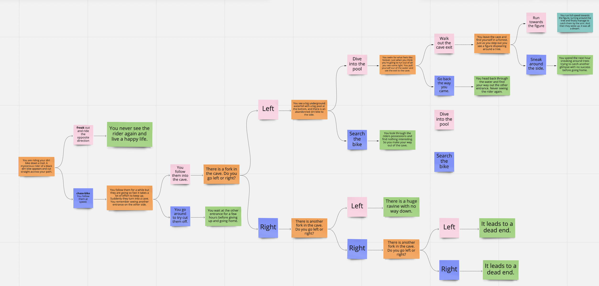

# Reflection

I wanted to build a site that was a bit different and a bit fun and made use of how easy it is to create mutiple pages becuase of the template system that SSGs have. So I decided to create a Choose your own adventure site, as these are very simple pages but there are a LOT of them. I really enjoyed the process and the fun of building something a little bit different. I created a story purely for this purpose.

## Design
I knew I would only need three layouts for the site, a 'home' page, a 'choice' page and a 'end' page. I drew up a hierarchy chart to create a flow for the game, so I knew exactly how many pages to build and which other pages they would link to.
The hierachry can be seen below:

## Creating the templates
I created all three templets with tester pages first. Making sure that each template was responsive.

## Creating the pages
Once the templates had been created it was only a matter of creating the hierachy using them. This was done with a whole bunch of markdown files. The links were added to the page seperately using the info from the file.

## Final Touches
Having set up all the pages and linked them up, it was time to run through the site in full. While I found it to be a bit clunky sometimes, all in all it worked quite well.

## 'Make it Live' attempt
After building out the site with npm, I used the Siteground account I have from last year to put the site online. it can be found at [clairemcauliffe.com](clairemcauliffe.com) (hopefully). All in all it was a fun little project to complete, not entirely without it's faults, but I am pleased with the way it turned out.

# Begin Ben's Text

## 11056 Project 2 Starter

This is repo containing everything you need to start Project 2. All you need to do is clone this repository to your computer and start editing...

Make sure you refer to Canvas for more info.

## Install Elventy
From Terminal, navigate to the folder you saved the repository in:

Type `npm create`

or, if that doesn't work: `npm install --save-dev @11ty/eleventy`

## Test your site

Open Terminal and type: `npm start`

This will create a local server to test the website.

Go to: http://localhost:8080 to view your site

## Build the site

Run `npm build`

Open up your site folder and you'll discover a folder within it called `final-website` this is where your actual site files are located. 

